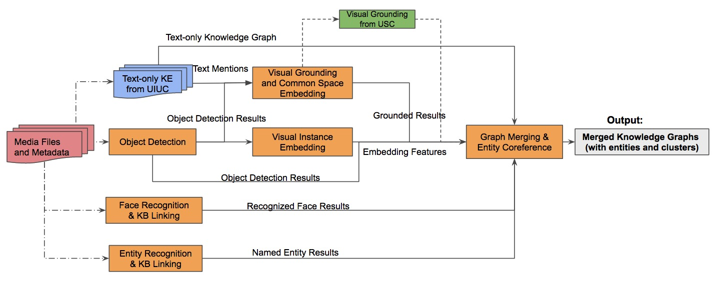

# Visual Grounding and Graph Merging for AIDA Project

#### Source provided by Bo Wu (Bobby) Columbia University

#### 3 Main Modules: Feature Extraction, Visual Grounding and Instance Matching, Graph Merging

### A. Overview  


### B. Environment Installation
Local development environment:
  - Python 3.6.3   
  - Anaconda 3-4.4  
  - Tensorflow 1.12.0  

Using Docker

```
$ docker build . --tag columbia-gm
$ docker run -itd --gpus 1 --name aida-gm -v /scratch/napiersk/home/src2/bobby/data/data_bobby:/root/data -v /scratch/napiersk/columbia/feb11:/root/dryrun/data -v /scratch/napiersk/columbia/isi_corpus_docs_m18_evaluation/docs:/root/dryrun/docs columbia-gm /bin/bash
$ docker exec -it aida-gm /bin/bash
# python smoke_test.py
# python Feature_Extraction.py
# python Visual_Grounding_mp.py
# python Graph_Merging.py

$ docker build . --tag columbia-gm
$ docker run -itd --name aida-gm -p [HOST_PORT]:8082 -v /data/src/bobby/data/data_bobby:/root/data:ro -v /nfs/isicvlnas01/projects/AIDA/2019-05-dryrun/dryrun:/root/dryrun columbia-gm /bin/bash
$ docker port aida-gm
$ docker exec -it aida-gm /bin/bash
# jupyter notebook --allow-root --ip=0.0.0.0 --port=8082 & 
# Access jupyter on the host machine [HOST_URL]:[HOST_PORT].

$ docker exec -it aida-gm /bin/bash
$$ python ./Feature_Extraction.py
$$ echo expect to see get [CU Visual_Features] files:
cu_visual_grounding_shared/cu_grounding_matching_features/semantic_features_jpg.lmdb, semantic_features_keyframe.lmdb, instance_features_jpg.lmdb, instance_features_keyframe.lmdb
$$ echo expect to see get [CU Grounding] file: cu_visual_grounding_shared/cu_grounding_results/E/grounding_dict_E1.pickle
$$ python ./Visual_Grounding_mp.py
$$ echo expect to see get [CU Dictionary] files for USC: 'cu_visual_grounding_shared/cu_grounding_dict_files/E/entity2mention_dict_E1.pickle', 'cu_visual_grounding_shared/cu_grounding_dict_files/E/id2mentions_dict_E1.pickle'
$$ python ./Graph Merging.py
$$ echo expect to see get [CU Merging] files: 'cu_visual_grounding_shared/cu_graph_merging_ttl/merged_ttl_E1/ 

```

##### The 3 main steps should be run one by one: 

1. Feature_Extraction.ipynb
2. Visual_Grounding_mp.ipynb
3. Graph_Merging.ipynb 

The steps associates with "feature_extraction", "grounding and instance matching" and "graph merging" parts.

There is one thing need to be noticed when you run the grounding part. Because our system will merge the grounding results from both CU and USC. So the first step is to generate the immediate dictionary files for USC, and then get the grounding results  (as dictionary object) from them. Finally, the system will merge two types of grounding results.

### C. Parameter Setting  
Grounding score threshold: 0.85  
Sentence score threshold: 0.6  
Version:  
```
# Set evaluation version as the prefix folder
version_folder = 'E/'
# Set run version as prefix and uiuc_run_folder
p_f_run = 'E1' # E5
uiuc_run_folder = 'RPI_TA1_E1/'
# Set the number of multiple processes
processes_num = 32
```

### D. Dataset Download  

##### TA1

Specify data paths

```
LDC2019E42=/path/expanded/ldc/
dryrun=/diff/path/

AVAILABLE_GPU=0
models=/path-to-models/
shared=/path-shared-data/

# Initialization
corpus_path = LDC2019E42
working_path = shared + 'cu_visual_grounding_shared/'
model_path = models + 'cu_visual_grounding_models/'
```


#### 1. Corpus Data Download  
```
    download the folder /docs/ from GoogleDrive (/isi_corpus_docs_m18_evaluation/), saved as corpus_path+'/docs'
    download the folder /data/ from GoogleDrive (/isi_corpus_data_m18_evaluation/), saved as corpus_path+'/data'
```  
File List:  
[LDC] 3 files (from ISI, sorted by Manling)  
[LTF] file (from ISI)

```
root
  to: working_path = shared_root + 'cu_visual_grounding_shared/'
  from: corpus_path = '/root/dryrun/'
  to: corpus_path = LDC2019E42
model
  from: model/
  to: model_path = models_root + 'cu_visual_grounding_models/'
shared
  from: /objdet_results/, rpi_ttl/,raw_files/, tmp/, usc_dict/, /cu_ttl,/merged_ttl
  to: /cu_objdet_results/, uiuc_ttl_results/,uiuc_asr_files/, cu_grounding_dict_files, usc_grounding_dict/, /cu_ttl_tmp,/cu_graph_merging_ttl
local
  from: all_features/
  to: cu_grounding_matching_features/, cu_grounding_results/
```
#### 2. Input Data Download  
```
    Download the data folders from GoogleDrive (model_data_bobby/data/cu_visual_grounding_shared/, model_data_bobby/data/cu_visual_grounding_models/), and the folders save as working_path and model_path.
```  
File List:  
[UIUC] 3 files (from Manling)  
```
    # Download from GoogleDrive
    cu_visual_grounding_shared/uiuc_ttl_results/
    cu_visual_grounding_shared/uiuc_asr_files/
```  
[CU obj_det] files (from Alireza)   
```
    cu_visual_grounding_shared/cu_objdet_results/
```  
[USC] files (from Arka)   
```
    cu_visual_grounding_shared/usc_grounding_dict/
```  
[CU clustering] files (from Brian)
```
    cu_visual_grounding_shared/cu_ttl_tmp/
```  

[Model] files (from Bobby)    
```
    cu_visual_grounding_models/
```

#### 3. Results or Intermediate Data Download for Module Testing  
[CU Visual_Features] files (from Bobby)  
```
    cu_visual_grounding_shared/cu_grounding_matching_features/
```
[CU Grounding] files (from Bobby)  
```
    cu_visual_grounding_shared/cu_grounding_results/
```
[CU Dictionary] files (from Bobby)
```
    cu_visual_grounding_shared/cu_grounding_dict_files/
```
[CU Merging] files (from Bobby) 
```
    do not need to use for testing
```

### E. Required Input/Result Output of Each Module  

#### 1. Feature Extraction  
#### Input:   
[LDC] 4 files  
```
    parent_child_tab = corpus_path + 'docs/parent_children.sorted.tab'
    kfrm_msb = corpus_path + 'docs/masterShotBoundary.msb'
    kfrm_path = corpus_path + 'data/video_shot_boundaries/representative_frames'
    jpg_path = corpus_path + 'data/jpg/jpg/' 
```
[UIUC] 2 files  
```
    video_asr_path = working_path + 'uiuc_asr_files/' + version_folder +'ltf_asr/'
    video_map_path = working_path + 'uiuc_asr_files/' + version_folder +'map_asr/'
```
[CU obj_det] files  
``` 
    det_results_path_img = working_path + 'cu_objdet_results/' + version_folder + 'det_results_merged_34a_jpg.pkl'
    det_results_path_kfrm = working_path + 'cu_objdet_results/' + version_folder + 'det_results_merged_34b_kf.pkl'
```  
[CU grounding_model] files
```
    grounding_model_path = model_path + 'model_ELMo_PNASNET_VOA_norm'
    matching_model_path = model_path + 'model_universal_no_recons_ins_only'
```
#### Output:   
[CU Visual_Features] Common Space Embeddings (for grounding)  
```
    out_path_jpg = working_path + 'cu_grounding_matching_features/' + 'semantic_features_jpg.lmdb'
    out_path_kfrm = working_path + 'cu_grounding_matching_features/' + 'semantic_features_keyframe.lmdb'
```
[CU Visual_Features] Instance Matching Features (for instance clustering)  
```
    out_path_jpg = working_path + 'cu_grounding_matching_features/' + 'instance_features_jpg.lmdb'
    out_path_kfrm = working_path + 'cu_grounding_matching_features/' + 'instance_features_keyframe.lmdb'
```

#### 2. Visual Grounding and Instance Matching   
#### Input: 
[LDC] 5 files  
```
    parent_child_tab = corpus_path + 'docs/parent_children.sorted.tab'
    kfrm_msb = corpus_path + 'docs/masterShotBoundary.msb'
    kfrm_path = corpus_path + 'data/video_shot_boundaries/representative_frames'
    jpg_path = corpus_path + 'data/jpg/jpg/'
    ltf_path = corpus_path + 'data/ltf/ltf/'
```
[UIUC] 4 files
```
    txt_mention_ttl_path = working_path + 'uiuc_ttl_results/' + version_folder + uiuc_run_folder # 1/7th May
    pronouns_path = working_path + 'uiuc_asr_files/' + 'pronouns.txt'
    video_asr_path = working_path + 'uiuc_asr_files/' + version_folder +'ltf_asr/'
    video_map_path = working_path + 'uiuc_asr_files/' + version_folder +'map_asr/'
```
[CU obj_det]   
```
    As mentioned before.   
```  
#### Intermediate Output:  
[CU Dictionary] files (for USC)
```
    entity2mention_dict_path = working_path + 'cu_grounding_dict_files/' + version_folder + 'entity2mention_dict_'+p_f_run+'.pickle'
    id2mentions_dict_path = working_path + 'cu_grounding_dict_files/' + version_folder + 'id2mentions_dict_'+p_f_run+'.pickle' 
```  
#### Output:  
[CU Grounding] files  
```
    grounding_dict_path = working_path + 'cu_grounding_results/' + version_folder + 'grounding_dict_'+p_f_run+'.pickle'
    grounding_log_path = working_path + 'cu_grounding_results/' + version_folder + 'log_grounding_'+p_f_run+'.txt'
```


#### 3. Graph Merging  
#### Input:    
[LDC] 3 files  
```
    parent_child_tab = corpus_path + 'docs/parent_children.sorted.tab'
```
[CU Visual_Features] files  
```
    Generated by the module of Visual Feature: cu_grounding_matching_features/semantic_features_jpg.lmdb, semantic_features_keyframe.lmdb, instance_features_jpg.lmdb, instance_features_keyframe.lmdb
```
[CU Grounding] file  
```
    Generated by the module of Visual Grounding: grounding_dict_path = working_path + 'cu_grounding_results/' + version_folder + 'grounding_dict_'+p_f_run+'.pickle'
```
[USC] file  
```
    usc_dict_path = working_path + 'usc_grounding_dict/' + version_folder + 'uscvision_grounding_output_cu_format_' + p_f_run + '.pickle' 
```  
[UIUC] file  
```
    txt_mention_ttl_path = working_path + 'uiuc_ttl_results/' + version_folder + uiuc_run_folder # 1/7th May
```  
[CU clustering] 2 files  
```
    cu_ttl_tmp_path = working_path + 'cu_ttl_tmp/'
    cu_ttl_path = cu_ttl_tmp_path + version_folder + 'm18_' + p_f_run + '/'
    cu_ttl_ins_path = cu_ttl_tmp_path + version_folder + 'm18_i_c_' + p_f_run + '/'
```  
#### Output: 
[CU Merging]  files   
```
    merged_graph_path = working_path + 'cu_graph_merging_ttl/' + version_folder + 'merged_ttl_'+ p_f_run + '/'
```

### F. Main Steps of Running  
#### Feature Extraction  
get the data from [UIUC] and [CU obj_det]  
Run feature extraction program   
#### Grounding and Instance Matching  
Run the first one part of grounding program to generate intermediate dict file for [USC]  
Merge the intermediate file from [USC]  
Run grounding program and generate results (parallelly)  
#### Graph Merging  
Get updated cu_ttl from [CU clustering]   
Run merging program    
#### Result Checking  
Check grounding dict result  
Check grounded entities and clusters  
Check the prefix for entity (columbia or usc ..)  
Check merged_ttl by validator on local server pineapple    
Output: /data/merged_ttl/  

### G. Grounding Example  
CU grounding_dict file  

```

'http://www.isi.edu/gaia/entities/c5649544-38d8-4e28-b104-af431556a1a1':{  
  'textual_features':array(  [  ],
  dtype=float32),
  'name':'Лавров',
  'type_rdf':  rdflib.term.URIRef('https://tac.nist.gov/tracks/SM-KBP/2018/ontologies/LDCOntology#Person'),
  'mentions':{  
    'f74850e12aef14b83bad4071dde1b2a6cb661':{  },
    'f74850e12aef14b83bad4071dde1b2a6cb664':{  
      'grounding':{  
        'IC00121KH.jpg.ldcc':{  },
        'IC00121KI.jpg.ldcc':{  },
        'IC00121KF.jpg.ldcc':{  },
        'IC00121KK.jpg.ldcc':{  }
      },
      'textual_features':array(      [  ],
      dtype=float32),
      'name':'Lavrov  Lavrov ',
      'sentence':'Lavrov  Lavrov  in the image'
    }

Examples for [CU ttl]:
IC0011VEA.ttl
IC00165CE HC000SYGU_16.mp4.ldcc 

'IC00121KF.jpg.ldcc':{  
          'bbox':[  ],
          'bbox_norm':[  ],
          'bbox_score':[  
            0.6378487
          ],
          'heatmap':array(          [  ],
          dtype=float32),
          'sen-img-score':0.62081313,
          'men-img-score':array(          [  ],
          dtype=float32),
          'grounding_features':array(          [  ],
          dtype=float32)
        },

```

### Updates

#### 2020.03.26 Update Paths
```
root
  to: working_path = shared_root + 'cu_visual_grounding_shared/'
  from: corpus_path = '/root/dryrun/'
  to: corpus_path = LDC2019E42
model
  from: model/
  to: model_path = models_root + 'cu_visual_grounding_models/'
shared
  from: /objdet_results/, rpi_ttl/,raw_files/, tmp/, usc_dict/, /cu_ttl,/merged_ttl
  to: /cu_objdet_results/, uiuc_ttl_results/,uiuc_asr_files/, cu_grounding_dict_files, usc_grounding_dict/, /cu_ttl_tmp,/cu_graph_merging_ttl
local
  from: all_features/
  to: cu_grounding_matching_features/
```
